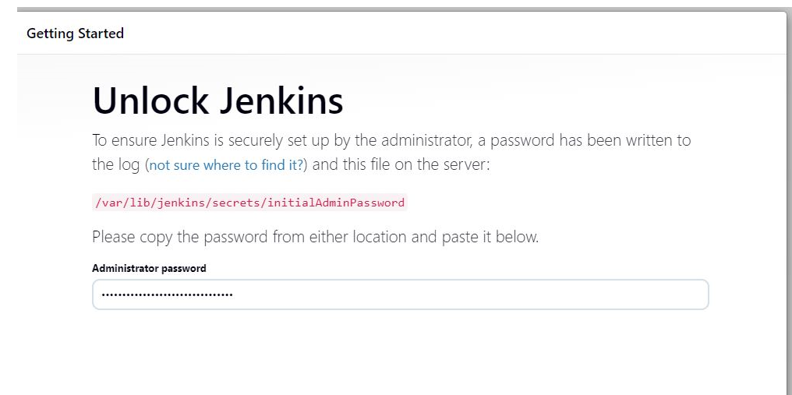
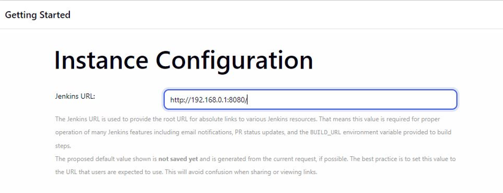
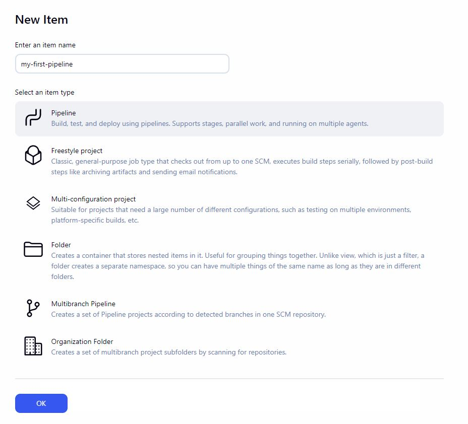
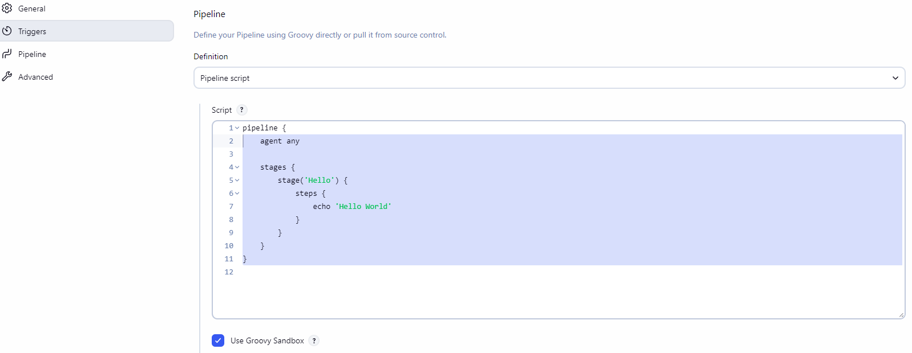
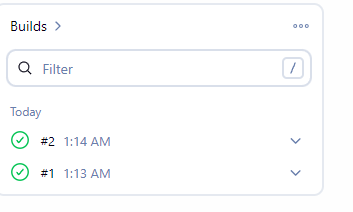
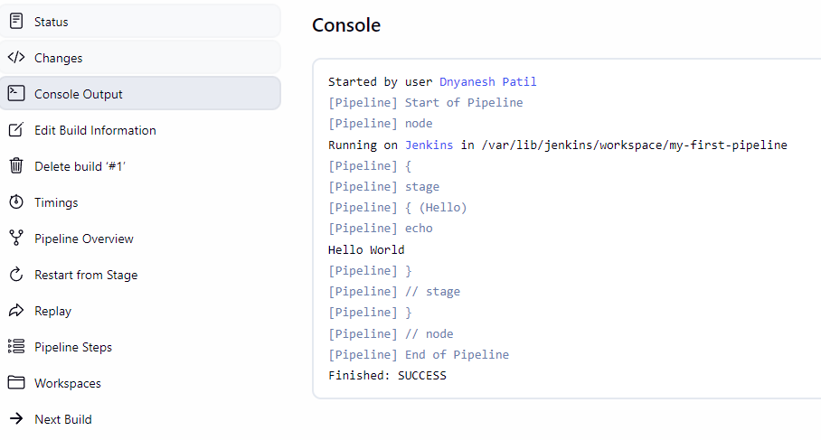
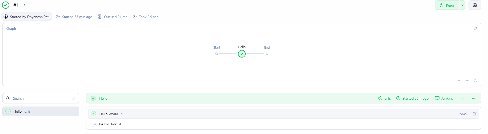

# Jenkins Server Configuration


> **Please note:** This is not a complete Jenkins CI/CD Course or Tutorial. Here we are trying to learn Installation and Configuration of Jenkins Server from Linux Server admin's POV

---

## What is Jenkins?

Jenkins is open-source, Web based automation tool used for Continuous Integration (CI) & Continuous Delivery (CD).

It automates building, testing and deploying software.

Jenkins have more than 1500+ plugins which use to integrate with almost every tool in DevOps system. Tools like, Git, Docker, Kubernetes & more. Example: If you want to use git, you can install a git plugin and use it.

- Jenkins runs on **Port 8080** - TCP & We manage it with help of Web browser
- We can also change port of Jenkins from file `/etc/sysconfig/jenkins`
- Jenkins agent to Master use **Port 50000** (Commonly used)

---

## Why Jenkins is Used

Jenkins mainly used for:

**a) Continuous Integration:**
Developers push code frequently Jenkins automatically builds and test the code. If something breaks, the team knows immediately.

**b) Continuous Delivery:**
After test pass, Jenkins can deploy the application to staging and production environments automatically.

**c) Automation:**
Jenkins also help with repetitive tasks like, running scripts, sending emails, generating reports, these tasks can be automated by using Jenkins.

**d) Extensions:**
Jenkins have more than 1500+ plugins which use to integrate with almost every tool in DevOps system. Tools like, Git, Docker, Kubernetes & more.

---

## Jenkins Architecture

**a) Master:**
Master is Central Jenkins server. It manages jobs, schedule builds, stores configurations and serves the web UI.
The master handles lightweight tasks and delegates actual builds to agents.

**b) Agent** (earlier it use to known as slave):
Agent is separate machine that executes build jobs. Agent allow Jenkins to scale. The master send jobs to agents and collect results.
Agents can be physical machines, VM or Containers.

**c) Node:**
Any Machine (Master or Agent) that can execute Jenkins Jobs. The Master Itself is Node.

**d) Executor:**
A Slot on node that runs one job at a time. A Node can have multiple executors to run parallel builds.

---

## Key Concepts of Jenkins

**a) Job (Project):**
Job is a task that Jenkins performs. Type of Job include freestyle, pipeline, multi-configuration & folders.

**b) Build:**
Build is execution of job. Each Build has number, Logs and status of job (Success, Failure, Unstable).

**c) Workspace:**
The directory on the node, where Jenkins download source code and run builds.

**d) Plugin:**
Plugin is Add-on that extends Jenkins functionality.
Ex: Git plugin, Docker Plugin.

---

## Types of Job in Jenkins

**a) Free Style Job:**
The simple type of job is freestyle job. You configure build steps, post build actions and triggers through WebUI.
It is good for simple tasks like running shell Scripting.

**b) Pipeline:**
Pipeline Defines the entire CI/CD process as code in Jenkins File. It Support stages, parallel execution & conditional logic.

- Declarative pipeline: it is simpler and structured.
- Scripted Pipeline: it is more flexible and groovy based pipeline.

**c) Multi-Branch Pipeline:**
Multibranch Pipeline automatically creates pipeline for each branch in Git Repository. Main Branch run production pipeline, feature branch run test pipelines.

**d) Folder:**
Folder is useful for organizing jobs by project or team. It keeps related jobs together.

---

## Jenkins Pipeline

A Pipeline defines entire CI/CD Flow. Example of Pipeline:

```groovy
pipeline {
    agent any
    stages {
        stage('Build') {
            steps {
                echo 'Building...'
            }
        }
        stage('Test') {
            steps {
                echo 'Testing...'
            }
        }
        stage('Deploy') {
            steps {
                echo 'Deploying...'
            }
        }
    }
}
```

**Key directives:**

| Directive | Description |
|-----------|-------------|
| `agent` | Specifies where the entire pipeline or a specific stage runs. (agent any, agent none, agent {label 'docker-node'}) |
| `stages` | A container that holds all the stage blocks. Each pipeline has exactly one stages section. It defines the sequence of work. Without stages, pipeline has no structure. Stages make the flow visible in the UI. Each stage shows success or failure separately. |
| `stage` | One logical part of pipeline. Each stage represents a phase like compile, test, or deploy. Contains steps that execute commands. Can also have its own agent, environment, or when conditions. |
| `steps` | Actual commands executed inside a stage. Steps can be shell commands, Jenkins built-in functions, or plugin steps. |
| `post` | Actions after pipeline (success, failure, always). Defines actions to run after the pipeline completes, regardless of whether it succeeded or failed. |
| `environment` | Sets environment variables that are available during the pipeline. |
| `when` | Controls whether a stage runs based on conditions. If the condition is false, the stage is skipped. |

---

## Common Jenkins Use Cases

**a) Build and Test:**
Every time a developer pushes code to Git, Jenkins automatically pulls the code, compiles it, runs tests, and creates deployable artifacts.

How it works:
- Jenkins detect code change via webhook or polling.
- It checks out source code from Git Repository.
- Compiles the code using build tools (Maven for Java, npm for node.js).
- It run unit tests to catch bugs early.
- Produces artifact like JAR files, Docker images or binary files.
- It store artifacts for later deployment.

**b) Deploy:**
Once code pass tests Jenkins deploy the application to servers. Deployment can be to development, staging or Production environment.

- It takes artifacts from build stage.
- Copies files to target servers (via scp, rsync or artifact repository).
- Restart services (Tomcat, Nginx, systemd services).
- For containers: Build Docker images, pushes to registry and update Kubernetes manifests.
- Can do rolling updates or blue-green Deployment.

**c) Notification:**
Jenkins notifies the team about build status. This keeps everyone informed without constantly checking the dashboard.

- After pipeline completes, Jenkins sends a message. This message includes status (success or failure), build number, time taken and link to logs.
- Can be notified via Teams, email, Slack, SMS in case of Critical failures.

**d) Scheduled Jobs:**
Similar to cron job, Jenkins can run jobs on schedule, these mostly uses in maintenance or reporting related task which does not need code changes to trigger.

- Job configured with cron syntax.
- Jenkins triggers the job at specified time and no change in code is needed.
- It runs independently.

Common scheduled tasks are:
- Database backup (daily 2 AM)
- Report Generation (Daily 7:00 PM)

---

## Key Files and Directories

| Path | Description |
|------|-------------|
| `/var/lib/jenkins` | Jenkins home directory |
| `/var/lib/jenkins/secrets/initialAdminPassword` | Admin password on first install |
| `/var/lib/jenkins/plugins` | Installed Plugins |
| `/var/lib/jenkins/jobs` | Job Configuration |
| `/var/log/jenkins/jenkins.log` | Jenkins logs |

---

# Practical

## Step 1 — Set Hostname and Install Java

```bash
hostnamectl set-hostname JENKINSSERVER
reboot
```

We need to install Java Packages first, as Jenkins works on java and required java 17.

> Please refer Official Documentation for installation of Jenkins on Linux: https://www.jenkins.io/doc/book/installing/linux/

```bash
dnf install java-17-openjdk -y
java --version
# openjdk version "17.0.18" 2026-01-20 LTS
# OpenJDK Runtime Environment (Red_Hat-17.0.18.0.8-2) (build 17.0.18+8-LTS)
# OpenJDK 64-Bit Server VM (Red_Hat-17.0.18.0.8-2) (build 17.0.18+8-LTS, mixed mode, sharing)
```

---

## Step 2 — Add Jenkins Repository and Install

```bash
# Download Jenkins repository configuration file
sudo wget -O /etc/yum.repos.d/jenkins.repo https://pkg.jenkins.io/rpm-stable/jenkins.repo
```

This command downloads the Jenkins repository configuration file and saves it to the system's repository directory so package manager (yum, dnf) knows where to find Jenkins packages.

```bash
# Update all installed packages
yum upgrade -y
```

This command updates all installed packages on your system to their latest available versions.

```bash
# Import Jenkins GPG key
rpm --import https://pkg.jenkins.io/redhat-stable/jenkins.io.key
```

The rpm --import command was used to import Jenkins' GPG key so that our system could verify the Jenkins package was authentic and signed by Jenkins. This is a standard security step.

```bash
# Install Jenkins
dnf install jenkins -y

# Enable and Start Jenkins
systemctl enable jenkins
systemctl start jenkins
systemctl status jenkins
```

---

## Step 3 — Configure Firewall

We will add Jenkins in Firewall so that users and build agents can access web interface on port 8080 and agent can communicate with master on port 50000.

```bash
firewall-cmd --permanent --add-service=jenkins --zone=public
# OR
firewall-cmd --add-port=8080/tcp --zone=public --permanent

firewall-cmd --reload
firewall-cmd --list-all
```

---

## Step 4 — Access Jenkins Web UI

Get our Initial Admin Password:

```bash
cat /var/lib/jenkins/secrets/initialAdminPassword
```

Check VM IP address:

```bash
ifconfig
```

Open browser and access Jenkins UI - let's assume our ip address is 192.168.0.1:

```
http://192.168.0.1:8080
```

The Jenkins UI Screen will appear and ask for password.



Once password is provided, it will ask us to install plugins. Here we can select required plugins and install them. For now we will select suggested plugins and proceed so it will automatically install the suggested plugins.

Once plugins are installed the Jenkins will ask us to create first admin user.

Once we create user it will provide us Jenkins url: `http://192.168.0.1:8080`



Our Jenkins url is now ready & now other users can access Jenkins by using url: `http://192.168.0.1:8080`

Once Jenkins is logged in we can see a Dashboard where we can:
- Create a job
- Set up an agent
- Set up a Cloud

---

# Pipeline

## Step 5 — Create First Pipeline

For now we will create a Pipeline. On Jenkins Dashboard, Click on **New Item** and in type select **Pipeline** and name it as `my-first-pipeline`.



Press OK and on next page, We will add pipeline Script.



Now We Run the pipeline, Click on **Build Now** and we can see a build number will appear in build history.



We can click the build number that just appear (ex #1).

Here in console output we can see the result. Here we can see 'Hello World' from Jenkins Pipeline.



We can also see stage Visualization: Click on Pipeline, from left menu inside build and we can see stage view of our pipeline.



---

# Interview Questions

**Q: What is Jenkins and why is it used?**

Jenkins is an open-source automation tool used for Continuous Integration and Continuous Delivery. It automates building, testing and deploying software. It is used because it integrates with almost every DevOps tool through plugins and helps teams detect failures early by automatically building and testing code on every commit.

---

**Q: What is the difference between CI and CD in Jenkins?**

CI (Continuous Integration) means Jenkins automatically builds and tests code every time a developer pushes changes. CD (Continuous Delivery) means after tests pass, Jenkins automatically deploys the application to staging or production environments.

---

**Q: What is a Jenkinsfile?**

A Jenkinsfile is a text file that defines the entire CI/CD pipeline as code. It is stored in the source code repository. It allows pipeline to be versioned, reviewed and reused.

---

**Q: What is the difference between Declarative and Scripted Pipeline?**

Declarative pipeline is simpler and structured - it follows a fixed syntax. Scripted pipeline is more flexible and Groovy based - it gives more control but is more complex.

---

**Q: What is Master-Agent architecture in Jenkins?**

Master is the central Jenkins server that manages jobs, schedules builds and serves the web UI. Agent is a separate machine that executes the actual build jobs. This allows Jenkins to scale by distributing work across multiple machines.

---

**Q: What are executors in Jenkins?**

Executor is a slot on a node that runs one job at a time. A node can have multiple executors to run parallel builds.

---

**Q: What is the default port of Jenkins?**

Jenkins runs on port 8080 by default. We can change it from `/etc/sysconfig/jenkins`. Agent to master communication uses port 50000.

---

**Q: Where are Jenkins logs stored?**

Jenkins logs are stored at `/var/log/jenkins/jenkins.log`.

---

# Troubleshooting

| Issue | Cause | Fix |
|-------|-------|-----|
| Jenkins service fails to start | Wrong Java version installed | Install Java 17 - `dnf install java-17-openjdk -y` |
| Cannot access port 8080 | Firewall blocking port | Run `firewall-cmd --add-port=8080/tcp --zone=public --permanent` |
| Forgot admin password | Need to reset | Get from `/var/lib/jenkins/secrets/initialAdminPassword` |
| Build fails immediately | Missing plugin or wrong config | Check console output for exact error |

---
## Result

- Jenkins installed successfully  
- Service running on port 8080  
- Web UI accessible  
- Initial setup completed  

This setup can be extended further to create pipelines and automate deployments.


*Document prepared as part of DevOps Home Lab — Linux Server Configuration Series*
