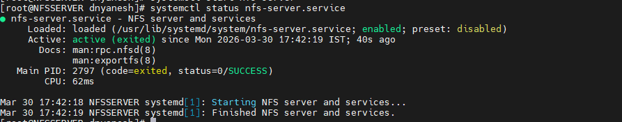
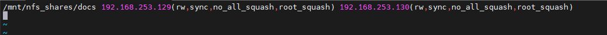
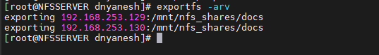
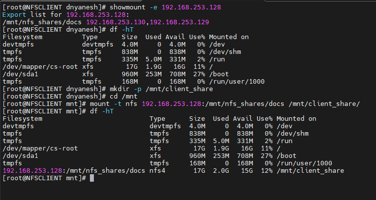
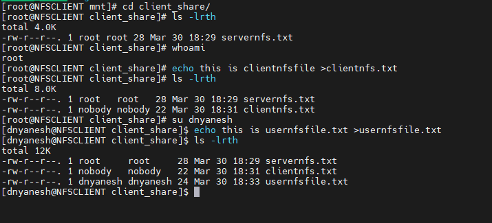
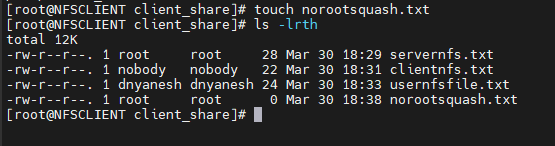
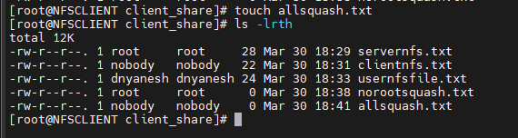

# NFS Server


---

## What is NFS?

NFS stands for network file server.

NFS (Network File System) is a protocol that allows one system to share its files and directories with other systems over a network. NFS is a remote directory on another machine behaves like it is part of your local system. So instead of copying files between servers, multiple systems can directly access the same shared storage.

- **Port number of NFS:** port 2049
- NFS is Linux-to-Linux file sharing. Samba/CIFS is used when Windows clients need to access Linux shares.

---

## Why NFS is Used

In prod environment, multiple servers often need access to the same data.

For ex:

**a)** When multiple web servers run the same application, they often need to access shared files like user uploads, configuration files, or cached data. NFS provides a central location where all servers can read and write these files.

**b) Centralized Storage:** NFS allows one server to host files that many clients need. This reduces disk usage, simplifies backups, and ensures everyone accesses the same version of files. Instead of Duplicating data everywhere, NFS provides one central location.

**c)** In environments with many Linux servers, user home directories are often stored on an NFS server. Users can log into any server and find their files exactly as they left them.

---

## How NFS Works

NFS Works on Client-Server Model

| Component | Role |
|-----------|------|
| NFS Server | Shared a directory over network and control the access like who can connect and who can have read-write permissions |
| NFS Client | NFS Client connects to servers, mount shared directory and uses it like a local folder |

---

## Key Components of NFS

**a) /etc/exports** : the files is use to defined which directories are shared and who can access them. The server decides which directories to export, which clients can access them, and what permissions those clients have.

**b) mount** : it is used by Client to attach remote directory. Client connects/attach remote directory to local path, once mounting done remote files behave like local files. And we can use normal commands like ls, cat etc.

**c) NFS Service:** Handles File sharing

**d) Permissions:** Permissions are important, server controls - who can access and which user can have read only (ro) and read, write (rw) access. If permissions are wrong, client might now able to access files. Write logs or application might fails.

**e) Stateless Nature:** Server does not track client state. Like which file is opened by client or what client did before. Each request is independent.

---

## Key Configuration Files

**a) /etc/exports (Server Side):** This file defines which directories are shared and who can access them. Each line specifies a directory to export, the client or network that can access.

**b) /etc/fstab (Client Side):** in this file we can define which NFS shares should be mounted automatically at boot. Each entry includes the server address, export path, mount point, file system type, and options.

**c) /etc/idmapd.conf :** This file handles mapping of user and group IDs between server and client.

---

## Important Export Options

| Option | Description |
|--------|-------------|
| `ro` (read-only) | Clients can read files but cannot write or modify them. Used for static content |
| `rw` (read-write) | Clients can read and write files. The common setting for application data, home directories |
| `sync` | Writes are confirmed to disk before the server responds. But can slow performance. Mainly Use for critical data. |
| `async` | Writes are confirmed before they are fully written to disk. Faster but risks data loss if server crashes. Use for performance-sensitive temporary data. |
| `root_squash` | Maps the root user on the client to the nobody user on the server. Prevents client root from having root access on the server. This is the default and recommended for security. |
| `no_root_squash` | Allows root on the client to have root access on the server. Rarely used due to security risks |
| `no_subtree_check` | Disables subtree checking for better performance. Recommended for most exports. |

---

## Advantages of using NFS

- Easy to Set Up
- Centralized Data Management
- Reduces Data Duplication

---

## Limitation of NFS

- **Performance** depends on network, file access becomes slow, application response time increases, and system may appear laggy.
- **Single point of failure:** If NFS Goes down, all client lose access. Logs stop writing and application depending on NFS will fail
- **Security:** By default, NFS is not much secure, as it based on IP trust, and no strong authentication is there and data is not encrypted.

> NFS is mostly used in Small environment & Simple shared storage

---

## Modern Alternatives of NFS

| Service | Description |
|---------|-------------|
| AWS EFS | AWS manages NFS |
| S3 | Object Storage |
| EBS | Block Storage |

---

## NFS in Kubernetes

NFS is commonly used as a persistent volume in Kubernetes. An NFS export is defined as a PersistentVolume, and Pods claim it with a PersistentVolumeClaim.

This provides a simple way to give stateful applications persistent storage without deploying complex storage solutions.

The Kubernetes control plane does not manage NFS. It simply mounts the NFS share on the node where the Pod runs.

The NFS server must be maintained separately.

---

## Hands-on Practical Steps

### Configure NFS Server

```bash
# Set hostname
hostnamectl set-hostname NFSServer
hostname

# Install NFS Server
dnf install nfs-utils -y

systemctl start nfs-server
systemctl enable nfs-server
systemctl status nfs-server
```



---

### Create a Share Directory

```bash
mkdir -p /mnt/nfs_shares/docs
ls -ld /mnt/nfs_shares/docs
```

We can see owner and group is root for our share. We want to make user nobody as owner of this directory so we need to change owner and permissions.

```bash
chown -R nobody: /mnt/nfs_shares/docs
```

> Here we used user 'nobody' because Special system user with minimal privileges & mapped via root_squash to prevent root level access from client system. We don't use our regular user here as its not suitable for NFS exports that multiple client's access

```bash
ls -ld
# o/p: We can now see owner and group is now user nobody (nobody nobody)

# To see more details about user nobody
cat /etc/passwd | grep nobody
# o/p : nobody:x:65534:65534:Kernel Overflow User:/:/sbin/nologin
```

It does means nobody is a special system user with UID 65534, no login shell, and minimal privileges. When user have id : 65534 ( it means it is user with low privileges)

Now we want to use this share as read write access, so client machine users will able to create files as well so we need to give them full permissions.

```bash
chmod -R 777 /mnt/nfs_shares/docs
ls -ld /mnt/nfs_shares/docs
# here we can see drwxrwxrwx. Full access permissions

# Restart nfs services
systemctl restart nfs-server
```

---

### Configure /etc/exports

Now the share which we have created here, we will mention it in configuration file so client machines will able to access it. Main configuration file here is `/etc/exports`

```bash
vi /etc/exports
```

Add configuration block:

```
# Allow specific IPs
/mnt/nfs_shares/docs 192.168.253.129(rw,sync,no_all_squash,root_squash) 192.168.253.130(rw,sync,no_all_squash,root_squash)

# OR - this is to allow all machines within network to access the share
/mnt/nfs_shares/docs 192.168.253.0/24(rw,sync,no_all_squash,root_squash)
```

Save: `wq!`

Here, 192.168.253.129 192.168.253.130 are ip address of machines who will able to access share and gets below permissions:

- **rw** : read write access
- **sync** : When the client writes a file, the server confirms the write has been physically written to disk before telling the client "done. Sometimes it can be slow
- **no_all_squash** : Regular users on the client keep their own user ID when accessing files. If a client user has UID 1001, their actions on the server are performed as UID 1001.
- **root_squash** : This is the important security option. When the root user (administrator) on the client tries to access files, they are mapped to the "nobody" user on the server (UID 65534). This prevents a client administrator from having full control over the server's files. Root on client gets no special privileges.

```bash
# Restart NFS services
systemctl restart nfs-server.service

# exportfs -arv re-reads /etc/exports and applies the changes immediately
# without restarting the NFS service, showing output of what was exported
exportfs -arv
# exporting 192.168.253.129:/mnt/nfs_shares/docs
# exporting 192.168.253.130:/mnt/nfs_shares/docs
```





---

### Configure Firewall

We will configure our firewall and add nfs service. so firewall wont block incoming/outgoing traffic for nfs service.

```bash
firewall-cmd --permanent --add-service=nfs --zone=public
```

We can also add rpcbind service in firewall, rpcbind is service which redirects client to port number on which NFS Service is running in NFSv4 it is added by default , but however we still need to add rpc service in firewall.

```bash
firewall-cmd --permanent --add-service=rpc-bind --zone=public
```

We will add mountd service in firewall as well , as mountd service is that checks client permissions, when client mount an export & interact with NFS Server.

```bash
firewall-cmd --permanent --add-service=mountd --zone=public
firewall-cmd --reload
firewall-cmd --list-all   # check and verify is services is added or not
```

> Please note even if you add only NFSv4 , rpcbind and mountd will automatically get added in firewall

---

### Configure Client Machine

```bash
# Lets Provide a static hostname
hostnamectl set-hostname NFSCLIENT
hostname   # to verify if name is set
reboot

# to install nfs package on client machine
dnf install nfs-utils -y
```

From NFS server , we have exported a share (Filesystem, so on this client machine we will verify if we are able to view it.

```bash
showmount -e 192.168.253.128
# O/p : Export list for 192.168.253.128:
# /mnt/nfs_shares/docs 192.168.253.130,192.168.253.129
```

Here we are able to see details of our shared file system.

Now we will create a directory on client machine on which we will mount this share.

```bash
mkdir -p /mnt/client_share
cd /mnt
mount -t nfs 192.168.253.128:/mnt/nfs_shares/docs /mnt/client_share
df -hT
# here we can see that our share has been mounted
# 192.168.253.128:/mnt/nfs_shares/docs nfs4 17G 2.0G 15G 12% /mnt/client_share
# & type of this share is nfs4.
```



---

### Test File Access

Now we will go on Server machine and we will create a file in our NFS share.

```bash
cd /mnt/nfs_shares/docs
echo Dnyanesh is learning Devops and Linux Administration > servernfs.txt
ls -lrth   # Here we can see file has been created.
```

Now we will go on NFS Client machine

```bash
cd /mnt/client_share
ls -lrth   # here we will able to see the file name servernfs.txt & owner is root
```

Here, we can see:

```
-rw-r--r--. 1 root     root     30  servernfs.txt  # files created on server show owner as root as direct server access not affected by NFS options
-rwxrwxrwx. 1 nobody   nobody   61  nfsclient.txt  # Client root files show owner nobody because root_squash is active
-rw-r--r--. 1 dnyanesh dnyanesh 26  usernfs.txt    # Client user files show actual username because no_all_squash is active
```

Root_squash behavior here file name clientnfs is created from root account of client. Usernfsfile.txt is created by user dnyanesh on client file.



---

### Disable root_squash (Demo Only)

Now we will disable (root_squash). On NFS Server:

```bash
vi /etc/exports
```

```
/mnt/nfs_shares/docs 192.168.253.129(rw,sync,no_all_squash,no_root_squash) 192.168.253.130(rw,sync,no_all_squash,no_root_squash)
```

```bash
# save wq!
systemctl restart nfs-server.service
```

Now go on Client Machine, login with root account:

```bash
cd /mnt/client_share
touch norootsquash.txt   # create a file name norootsquash.txt
ls -lrth
# O/p : -rw-r--r--. 1 root root 0 Mar 30 16:07 norootsquash.txt
# so here we can see owner of this file is root & not nobody as earlier
```

So similarly if we check from server machine we will able to view the same. Owner of norootsquash.txt is root.



> Hence it is not recommended, the root user have full privileges and can do anything. Which is also security concern.

Re-enable root_squash:

```bash
vi /etc/exports
# /mnt/nfs_shares/docs 192.168.253.129(rw,sync,no_all_squash,root_squash) 192.168.253.130(rw,sync,no_all_squash,root_squash)
# save wq!
systemctl restart nfs-server.service
```

---

### Test all_squash (Demo Only)

Now We will trying using (all_squash) instead of (no_all_squash), On server Machine:

```bash
vi /etc/exports
```

```
/mnt/nfs_shares/docs 192.168.253.129(rw,sync,all_squash,root_squash) 192.168.253.130(rw,sync,all_squash,root_squash)
```

```bash
# wq!
systemctl restart nfs-server.service
```

Now Go on Client machine and login with user dnyanesh:

```bash
cd /mnt/client_share
vi allsquash.txt   # insert some data and save wq!
ls -lrth
```

so we can see here again nobody is owner/Group of this file allsquash.txt , as we have enable squashing for normal users as well.



---

### Unmount Share

```bash
umount /mnt/client_share
df -hT   # To Verify
```

We will rectify our export file configuration:

```bash
vi /etc/exports
# /mnt/nfs_shares/docs 192.168.253.129(rw,sync,no_all_squash,root_squash) 192.168.253.130(rw,sync,no_all_squash,root_squash)
# wq!
```

> Systems mentioned in /etc/exports files will only able to access and mount the file sharing

---

### Permanent Mount via /etc/fstab

We can also make an entry in fstab to make this entry permanent. On Client Machine:

```bash
vi /etc/fstab
```

Go to end of File & make an entry of our share:

```
192.168.253.128:/mnt/nfs_shares/docs /mnt/client_share nfs defaults,_netdev 0 0
```

> Server doesn't need fstab for export , /etc/fstab entry on CLIENT is used to mount NFS share automatically after reboot.

---

## Interview Questions

**Q: What is NFS and why would you use it?**

NFS is a protocol for sharing files over a network. I would use it when multiple servers need access to the same files, such as shared home directories, web application assets, or backup storage. It is simple to configure and works well for environments that do not need complex distributed file system features.

---

**Q: How do you export a directory on an NFS server?**

I add an entry in /etc/exports specifying the directory, allowed clients, and options. Then I run exportfs -a to apply the changes and restart the nfs-server service.

---

**Q: How do you mount an NFS share permanently on a client?**

I add an entry in /etc/fstab with the server IP, export path, mount point, filesystem type nfs, and options like defaults,_netdev. The _netdev option ensures the system waits for the network before attempting the mount.

---

**Q: What is root_squash and why is it important?**

Root_squash maps the root user on the client to the nobody user on the server. This prevents a client with root access from having root privileges on the server. It is an important security feature that limits the impact of a compromised client.

---

**Q: What is the difference between sync and async?**

Sync confirms writes to disk before responding, ensuring data integrity. Async is faster but risks data loss if the server crashes. Sync is used for critical data, async for performance-sensitive temporary data.

---

**Q: How do you check what directories an NFS server is sharing?**

I use the command showmount -e server-ip. This lists all exports available from that server.

---

**Q: What is a stale file handle error?**

It occurs when a client tries to access a file that was removed or changed on the server while the client still had it mounted. It is fixed by unmounting and remounting the share on the client.

---

## Troubleshooting Common Issues

| Issue | Cause | Fix |
|-------|-------|-----|
| Permission Denied | The client IP is not allowed in /etc/exports, or export options are too restrictive | Check /etc/exports and run exportfs -a after changes |
| Stale File Handle | The directory on the server was removed or changed while the client still had it mounted | Unmount and remount the share to fix |
| Connection Refused | NFS service is not running or firewall is blocking ports | Check service status and firewall rules |
| Slow Performance | Caused by network latency, sync option, or slow disk I/O on server | Consider using async or improving network |

---

*Document prepared as part of DevOps Home Lab — Linux Server Configuration Series*

