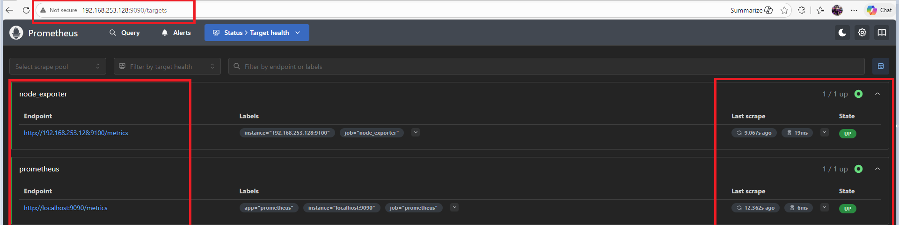
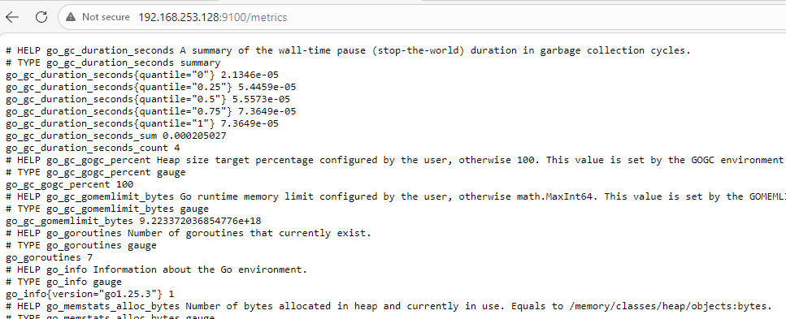
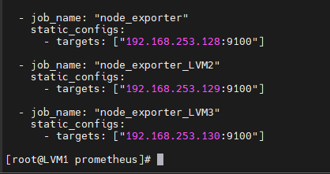
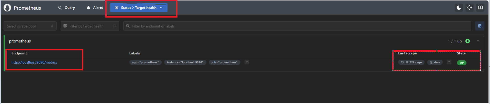
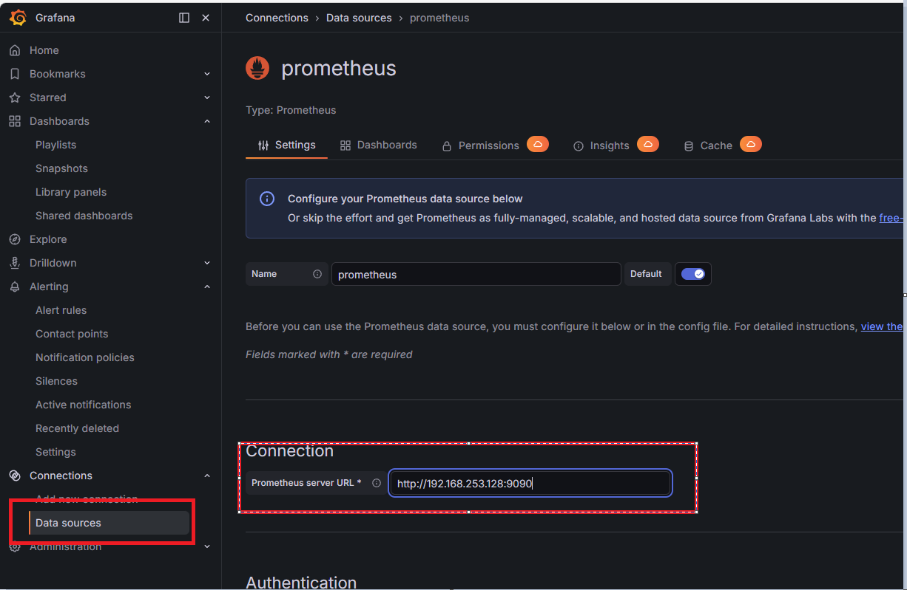
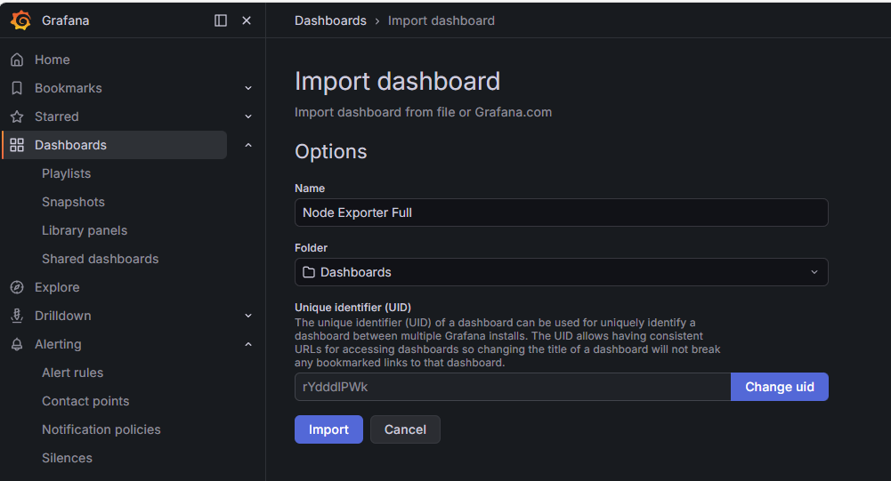
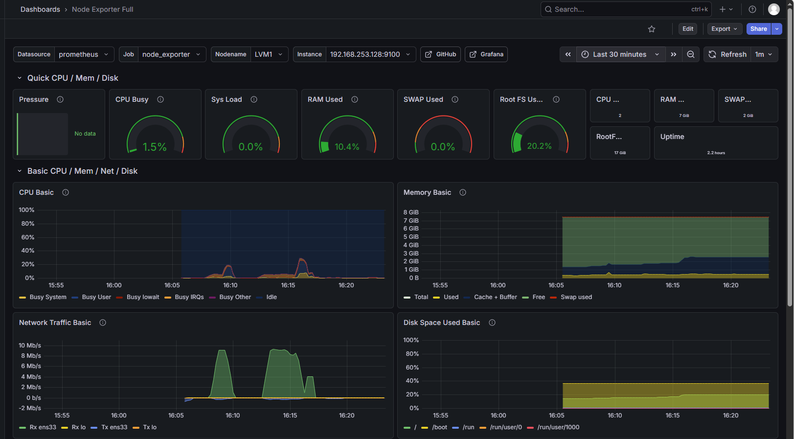
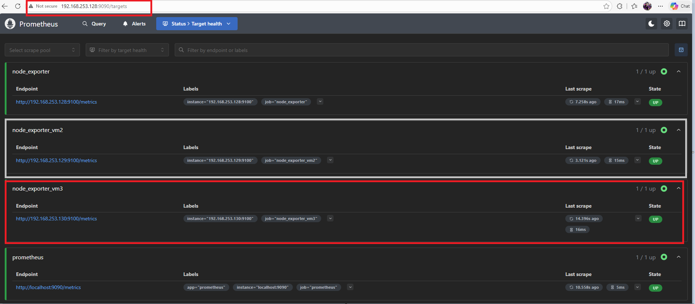
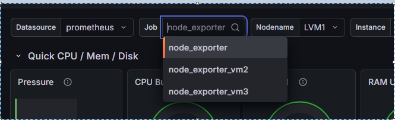

# Prometheus + Grafana — Linux Server Monitoring


---

## Problem

In a multi-server environment, monitoring each Linux machine manually is not scalable. There is no central visibility into CPU, memory, disk and network across multiple nodes at the same time.

## Solution

Set up a centralized monitoring stack using Prometheus to scrape metrics from 3 Linux VMs via Node Exporter, with Grafana providing real-time visualization through Dashboard 1860.

## Why This Stack

Prometheus and Grafana is the standard open-source monitoring stack used in production DevOps environments. It works without any cloud dependency and can scale to hundreds of servers by just adding targets to `prometheus.yml`.

## Production Use

Teams use this exact setup to monitor infrastructure health 24/7, detect failures early, and set up automated alerts before problems affect end users.

---

## VM Setup

| VM | Role | IP |
|----|------|----|
| LVM1 | Prometheus + Grafana Server | 192.168.253.128 |
| LVM2 | Target Machine 1 (Node Exporter) | 192.168.253.129 |
| LVM3 | Target Machine 2 (Node Exporter) | 192.168.253.130 |

## Architecture

```
LVM2 (Node Exporter :9100)  ─┐
                              ├──► Prometheus (:9090) ──► Grafana (:3000)
LVM3 (Node Exporter :9100)  ─┘
LVM1 (Node Exporter :9100)  ─┘
```

## Port Summary

| Service | Port |
|---------|------|
| Prometheus | 9090 |
| Node Exporter | 9100 |
| Grafana | 3000 |
| Alert Manager | 9093 |

---

## Key Concepts

**Pull Model** — Prometheus pulls metrics from nodes. It does not wait for nodes to send data. If Prometheus cannot pull metrics, the node is marked as down.

**Time-Series Data** — Each data point has a timestamp and value. This allows us to see trends like how CPU usage changed over the last hour.

**Labels** — Key-value pairs attached to metrics. For example: `instance="10.0.0.1"` and `mode="idle"`. Makes it easy to filter and group data.

**PromQL** — Prometheus Query Language. A simple query like `node_memory_MemAvailable_bytes` gives us available memory.

---

# Implementation

## Step 1 — Prepare the System (LVM1)

```bash
dnf update -y
reboot
```

```bash
# Disable SELinux
setenforce 0

vi /etc/selinux/config
# change SELINUX=enforcing to SELINUX=permissive
```

---

## Step 2 — Create Prometheus User and Directories

```bash
# Dedicated user with no shell — minimal privileges
sudo useradd --no-create-home --shell /usr/sbin/nologin prometheus

mkdir /etc/prometheus
mkdir /var/lib/prometheus

chown -R prometheus:prometheus /etc/prometheus
chown -R prometheus:prometheus /var/lib/prometheus
```

---

## Step 3 — Download and Install Prometheus

```bash
cd /tmp
wget https://github.com/prometheus/prometheus/releases/download/v3.10.0/prometheus-3.10.0.linux-amd64.tar.gz
tar -xf prometheus-3.10.0.linux-amd64.tar.gz
cd prometheus-3.10.0.linux-amd64
```

```bash
# Copy binaries to system PATH
cp prometheus /usr/local/bin/
cp promtool /usr/local/bin/

chown prometheus:prometheus /usr/local/bin/prometheus
chown prometheus:prometheus /usr/local/bin/promtool

# Copy web console files used by Prometheus UI
cp -r consoles /etc/prometheus/
cp -r console_libraries /etc/prometheus/
cp prometheus.yml /etc/prometheus/prometheus.yml
```

---

## Step 4 — Create Prometheus Systemd Service

```bash
vi /etc/systemd/system/prometheus.service
```

```ini
[Unit]
Description=Prometheus Monitoring
Wants=network-online.target
After=network-online.target

[Service]
User=prometheus
Group=prometheus
Type=simple
ExecStart=/usr/local/bin/prometheus \
  --config.file=/etc/prometheus/prometheus.yml \
  --storage.tsdb.path=/var/lib/prometheus \
  --web.console.templates=/etc/prometheus/consoles \
  --web.console.libraries=/etc/prometheus/console_libraries

[Install]
WantedBy=multi-user.target
```

```bash
systemctl daemon-reload
systemctl start prometheus
systemctl enable prometheus
systemctl status prometheus
```

```bash
# Open firewall for Prometheus
firewall-cmd --permanent --add-port=9090/tcp --zone=public
firewall-cmd --reload
```

Access Prometheus at `http://192.168.253.128:9090` → Status → Targets



---

## Step 5 — Install Node Exporter (on LVM1 first)

```bash
mkdir -p /var/lib/prometheus/node_exporter

cd /tmp
wget https://github.com/prometheus/node_exporter/releases/download/v1.10.2/node_exporter-1.10.2.linux-amd64.tar.gz
tar xvf node_exporter-1.10.2.linux-amd64.tar.gz
cd node_exporter-1.10.2.linux-amd64

cp node_exporter /usr/local/bin/

useradd --no-create-home --shell /usr/sbin/nologin node_exporter
chown node_exporter:node_exporter /usr/local/bin/node_exporter
```

```bash
vi /usr/lib/systemd/system/node_exporter.service
```

```ini
[Unit]
Description=Node Exporter
Wants=network-online.target
After=network-online.target

[Service]
User=node_exporter
Group=node_exporter
Type=simple
ExecStart=/usr/local/bin/node_exporter

[Install]
WantedBy=multi-user.target
```

```bash
systemctl daemon-reload
systemctl enable node_exporter
systemctl start node_exporter
systemctl status node_exporter

firewall-cmd --permanent --add-port=9100/tcp --zone=public
firewall-cmd --reload
```

Verify at `http://192.168.253.128:9100/metrics`



---

## Step 6 — Add Node Exporter to Prometheus Config

```bash
vi /etc/prometheus/prometheus.yml
```

Add at the end of the file:

```yaml
  - job_name: "node_exporter"
    static_configs:
      - targets: ["192.168.253.128:9100"]
```



```bash
# Validate before restarting — always do this
promtool check config /etc/prometheus/prometheus.yml

systemctl restart prometheus
```

Check `http://192.168.253.128:9090/targets` — both endpoints should be UP.



---

## Step 7 — Install Grafana

```bash
vi /etc/yum.repos.d/grafana.repo
```

```ini
[grafana]
name=grafana
baseurl=https://packages.grafana.com/oss/rpm
repo_gpgcheck=1
enabled=1
gpgcheck=1
gpgkey=https://packages.grafana.com/gpg.key
sslverify=1
sslcacert=/etc/pki/tls/certs/ca-bundle.crt
```

```bash
# Force DNF to read new repo and cache package list
dnf makecache -y

dnf install grafana -y

systemctl start grafana-server
systemctl enable grafana-server
systemctl status grafana-server

firewall-cmd --permanent --add-port=3000/tcp
firewall-cmd --reload
```

Access Grafana at `http://192.168.253.128:3000` — default login: `admin / admin`

---

## Step 8 — Connect Grafana to Prometheus

- Left sidebar → **Connections** → **Data Sources** → **Add data source**
- Select **Prometheus**
- URL: `http://192.168.253.128:9090`
- Click **Save & Test**




---

## Step 9 — Import Dashboard 1860

Direct import by ID may fail if Grafana cannot reach grafana.com from the VM. Download the JSON on Windows machine and upload manually.

```
https://grafana.com/api/dashboards/1860/revisions/latest/download
```

- **Dashboards** → **Import** → **Upload JSON file**
- Select Prometheus as data source → **Import**





---

# Adding More VMs

## Install Node Exporter on LVM2 and LVM3

Run these steps on each additional VM:

```bash
dnf update -y

useradd --no-create-home --shell /usr/sbin/nologin node_exporter

cd /tmp
wget https://github.com/prometheus/node_exporter/releases/download/v1.10.2/node_exporter-1.10.2.linux-amd64.tar.gz
tar -xvf node_exporter-1.10.2.linux-amd64.tar.gz
cd node_exporter-1.10.2.linux-amd64

cp node_exporter /usr/local/bin/
chown node_exporter:node_exporter /usr/local/bin/node_exporter
```

```bash
vi /usr/lib/systemd/system/node_exporter.service
```

```ini
[Unit]
Description=Node Exporter
Wants=network-online.target
After=network-online.target

[Service]
User=node_exporter
Group=node_exporter
Type=simple
ExecStart=/usr/local/bin/node_exporter

[Install]
WantedBy=multi-user.target
```

```bash
systemctl daemon-reload
systemctl enable node_exporter
systemctl start node_exporter

firewall-cmd --permanent --add-port=9100/tcp --zone=public
firewall-cmd --reload
```

Verify:
```
http://192.168.253.129:9100/metrics
http://192.168.253.130:9100/metrics
```

## Add LVM2 and LVM3 to Prometheus

On LVM1 (Prometheus server):

```bash
vi /etc/prometheus/prometheus.yml
```

```yaml
  - job_name: "node_exporter_LVM2"
    static_configs:
      - targets: ["192.168.253.129:9100"]

  - job_name: "node_exporter_LVM3"
    static_configs:
      - targets: ["192.168.253.130:9100"]
```

```bash
promtool check config /etc/prometheus/prometheus.yml
systemctl restart prometheus
```



The 1860 dashboard has a **job** dropdown at the top. Each VM appears as a separate option — select any VM to see its metrics. No changes needed in Grafana.



---

# Output

- Prometheus running and scraping metrics on port 9090
- Node Exporter exposing Linux system metrics on port 9100 across all 3 VMs
- All 3 targets showing UP in Prometheus targets page
- Grafana connected to Prometheus as data source
- Dashboard 1860 showing CPU, memory, disk, and network metrics in real time
- Job dropdown in Grafana showing LVM1, LVM2, LVM3 separately

---

## Key Files and Directories

| Path | Description |
|------|-------------|
| `/etc/prometheus/prometheus.yml` | Main Prometheus config file |
| `/var/lib/prometheus` | Metrics data storage |
| `/etc/systemd/system/prometheus.service` | Prometheus service file |
| `/usr/lib/systemd/system/node_exporter.service` | Node Exporter service file |
| `/etc/yum.repos.d/grafana.repo` | Grafana repository file |
| `/var/log/grafana/grafana.log` | Grafana logs |

---

# Troubleshooting

| Issue | Cause | Fix |
|-------|-------|-----|
| Prometheus fails to start | Wrong directory permissions | `chown -R prometheus:prometheus /etc/prometheus /var/lib/prometheus` |
| Targets showing DOWN | Firewall blocking port 9100 | `firewall-cmd --add-port=9100/tcp --zone=public --permanent` |
| Grafana cannot reach Prometheus | Wrong URL in data source | Use `http://<server-ip>:9090` not localhost |
| Dashboard 1860 Bad Gateway | Grafana cannot reach grafana.com | Download JSON on Windows, upload manually |
| Node Exporter not showing metrics | Service not running | `systemctl status node_exporter` |
| promtool check fails | YAML indentation error | Check spacing — YAML is space-sensitive |

---
## Challenges I Faced

1. **Grafana Dashboard Import Failed**
   - Issue: Direct import by ID from grafana.com failed because the VM had no internet access
   - Fix: Downloaded the JSON file on a Windows machine and uploaded it manually to Grafana
--

## What's Next

This setup can be further extended with:
- **Ansible Automation** — deploy Node Exporter and MySQL Exporter across multiple servers using Ansible playbooks instead of manual setup on each VM
- **Loki + Grafana** — add centralized log monitoring to the same Grafana instance alongside existing metrics dashboards
- **PostgreSQL Exporter** — , monitor PostgreSQL databases
- **Nginx/Apache Exporter** — monitor web server metrics like active connections and request rate
- **Blackbox Exporter** — monitor external endpoints and URLs for uptime and response time

---


*Document prepared as part of DevOps Home Lab — Linux Server Series*
